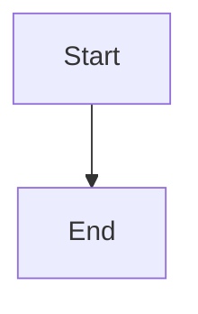

# Issue Writing Skill

This skill guides the creation of well-structured, actionable Linear issues that any developer or AI can pick up and execute independently.

## When to Use

Apply this skill when:
- Writing or drafting issue descriptions
- Defining acceptance criteria for tasks
- Breaking down features into sub-issues
- Reviewing existing issues for clarity
- Users ask how to document requirements

## Issue Structure: Parent Feature Issues

```markdown
## IMPORTANT: Linear Issue Discipline
[Standard discipline rules]

---

## Problem
[1-2 sentences: Why does this feature need to exist?]

## Solution
[1-2 sentences: What are we building to solve this?]

## High-Level Implementation
[Bullet points: Key technical decisions, patterns]

## Codebase Investigation Findings
[What patterns to follow, similar features, code locations]

## Out of Scope / Deferred
[Explicitly list what we're NOT doing]
```

## Issue Structure: Sub-Issues / Tasks

```markdown
## Objective
[1-2 sentences: What specific thing needs to be done?]

## Acceptance Criteria
- [ ] [Specific, testable criterion 1]
- [ ] [Specific, testable criterion 2]
- [ ] [Specific, testable criterion 3]

## Implementation Notes
- Relevant files: [paths]
- Patterns to follow: [reference]
- Dependencies: [other issues]
```

## Writing Good Acceptance Criteria (SMART)

- **Specific**: Clear about what exactly needs to happen
- **Measurable**: Can objectively verify if it's done
- **Achievable**: Within scope of this single issue
- **Relevant**: Directly related to the objective
- **Testable**: Can be validated by running/checking

## Principles for Issue Writing

1. **Self-Contained Context** - Everything needed to understand and execute
2. **What, Not How** - Describe outcome, not implementation
3. **Appropriate Granularity** - Not too big, not too small
4. **Link to Resources** - Design, API docs, related issues
5. **State Assumptions** - Make implicit expectations explicit

## Anti-Patterns to Avoid

- **Vague objectives**: "Improve the dashboard"
- **Missing acceptance criteria**: Assuming it's obvious
- **Implementation prescription**: Over-specifying the how
- **Hidden dependencies**: Not mentioning blockers
- **Scope creep**: Adding "nice to haves"

## Mermaid Diagrams in Linear Issues

**ALWAYS include Mermaid diagrams when applicable.** Linear supports Mermaid diagrams natively in issue descriptions. Use them to visualize:

- User flows and interaction sequences
- Data flow and processing pipelines
- State machines and lifecycle transitions
- Component relationships and dependencies
- API/service interaction patterns
- Entity relationships and data models

### Mermaid Syntax in Linear

Use standard markdown code fences with `mermaid` as the language identifier:

````markdown

````

### Common Diagram Types

| Type | Use Case | Syntax |
|------|----------|--------|
| `flowchart TD` | Top-down user flows, process flows | `flowchart TD` |
| `flowchart LR` | Left-right horizontal flows | `flowchart LR` |
| `sequenceDiagram` | API calls, service interactions | `sequenceDiagram` |
| `stateDiagram-v2` | State machines, status transitions | `stateDiagram-v2` |
| `erDiagram` | Database schemas, entity relationships | `erDiagram` |
| `classDiagram` | Class relationships, component structure | `classDiagram` |

### When to Include Diagrams

**Always include a diagram when:**
- Describing a multi-step process or user flow
- Explaining how components interact
- Documenting state transitions
- Showing data flow between systems
- Illustrating API call sequences
- Mapping entity relationships

**The diagram should appear in:**
- Parent issue "High-Level Implementation" section
- Sub-issue descriptions when flow context is needed
- Bug reports when showing expected vs actual flow
- Any issue where visual clarity aids understanding

Remember: **A good issue can be executed by anyone who reads it.**
