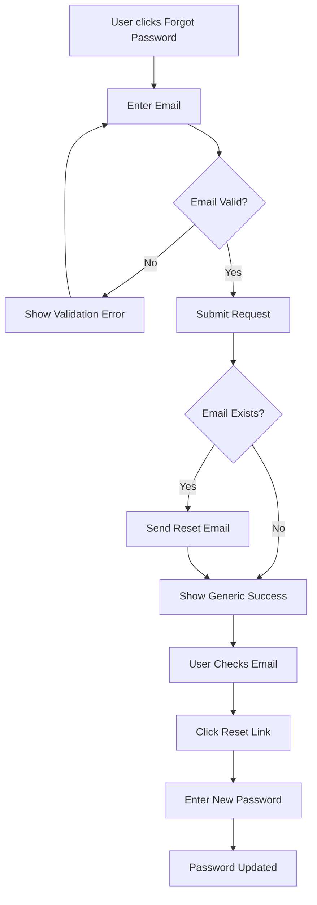
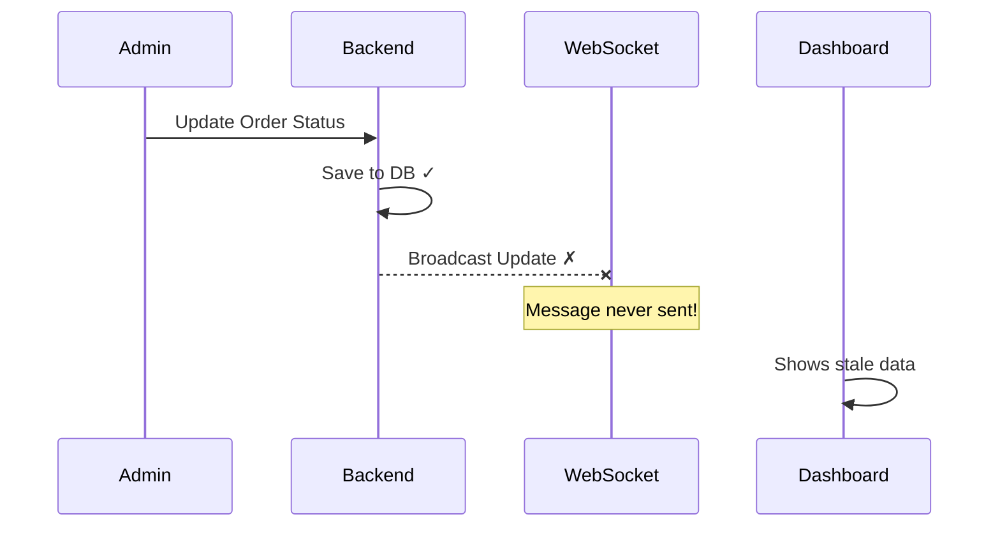
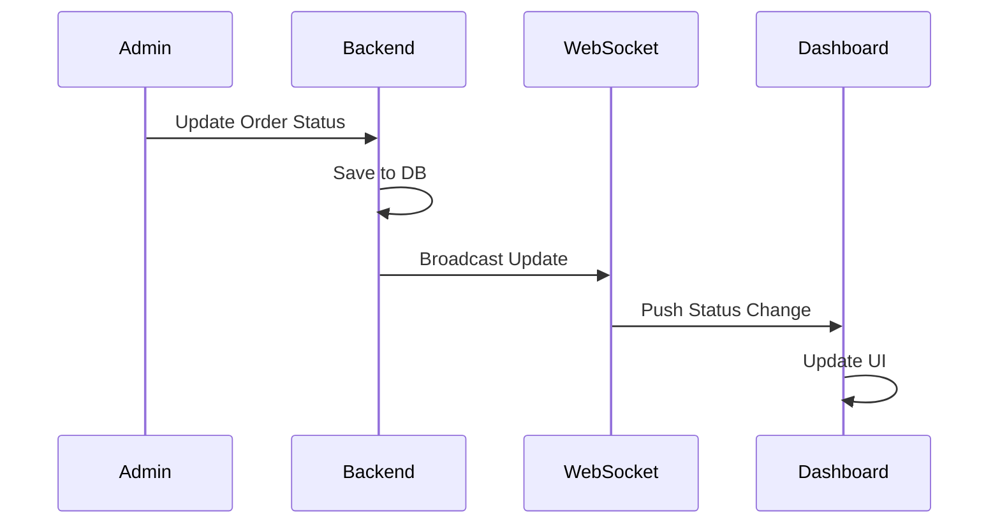

# Issue Writing Examples

## Example: Parent Feature Issue

### Password Reset Feature

```markdown
## IMPORTANT: Linear Issue Discipline

All development work must be tracked through Linear issues.
- Before starting work: Mark issue "In Progress"
- Upon completion: Mark issue "Done"
- Missing scope: Create sub-issue first, then proceed

A parent issue is NOT done until all sub-issues are done.

---

## Problem
Users cannot reset their password if they forget it, leading to
support tickets and account abandonment.

## Solution
Implement a password reset flow via email with secure token validation.

## High-Level Implementation
- Use existing email service (SendGrid integration)
- JWT tokens with 1-hour expiry for reset links
- Rate limiting: max 3 reset requests per hour per email

## Codebase Investigation Findings
- Auth patterns: src/services/auth/ - follow AuthService pattern
- Email templates: src/templates/email/ - use BaseEmailTemplate
- Similar feature: Email verification flow in src/features/verify/

## Out of Scope / Deferred
- SMS-based reset (future iteration)
- Security questions (not planned)
- Admin password reset capability (separate feature)
```

### User Flow Diagram



---

## Example: Sub-Issue (Vertical Slice)

### SLICE 1: Forgot Password Form

```markdown
## Objective
Create the "Forgot Password" form that captures user email and
triggers the reset email.

## Acceptance Criteria
- [ ] Form displays email input with validation
- [ ] Submit button disabled until valid email entered
- [ ] Success state shows "Check your email" message
- [ ] Error state shows message if email not found (generic for security)
- [ ] Loading state shown during API call
- [ ] Rate limit error displayed if exceeded

## Implementation Notes
- Relevant files: src/features/auth/components/
- Pattern to follow: LoginForm component structure
- API endpoint: POST /api/auth/forgot-password (to be created in SLICE 2)
- Use existing Button, Input, FormField atoms/molecules

## Context
Parent: [Password Reset Feature]
Related: [SLICE 2: Create reset email API endpoint]
```

---

## Example: Bug Fix Issue

### Fix: Login Button Disabled State

```markdown
## Bug Description
The login button remains in disabled state after clearing validation
errors, preventing users from submitting the form.

## Expected Behavior
Button should become enabled once all validation errors are cleared
and required fields are filled.

## Steps to Reproduce
1. Go to /login
2. Enter invalid email format
3. See validation error appear
4. Correct the email format
5. Notice button is still disabled (BUG)

## Acceptance Criteria
- [ ] Button enables when form is valid
- [ ] Button disables when form becomes invalid
- [ ] Regression test added for button state transitions
- [ ] Manual QA confirms fix

## Technical Notes
Likely issue in form state management, check useForm hook.
```

---

## Good vs Bad Acceptance Criteria

### Good Examples
```markdown
- [ ] User can enter email and password on login form
- [ ] Form validates email format before submission
- [ ] Successful login redirects to /dashboard
- [ ] Failed login shows error message below form
- [ ] Loading state shown during API call
```

### Bad Examples
```markdown
- [ ] Login works (too vague)
- [ ] Good user experience (not measurable)
- [ ] Handle all edge cases (not specific)
- [ ] Fast performance (not testable without metrics)
```

---

## Granularity Examples

### Too Big
"Build the authentication system"
- This is a feature, not a task
- Should be parent with sub-issues

### Too Small
"Add import statement for React"
- This is a code change, not a task
- Should be part of a larger issue

### Just Right
"Create login form with email/password fields and validation"
- Clear scope
- Testable outcome
- Reasonable size

---

## Example: Bug Issue with Diagram

### Fix: Order Status Not Updating in Real-Time

```markdown
## Bug Description
When an order status changes in the backend, the frontend dashboard doesn't
update in real-time. Users see stale status until they manually refresh.

## Current vs Expected Flow



## Expected Flow



## Steps to Reproduce
1. Open order dashboard in browser
2. Change order status via admin panel
3. Observe dashboard - status doesn't update
4. Refresh browser - status now shows correctly

## Acceptance Criteria
- [ ] Order status updates appear in real-time (within 2 seconds)
- [ ] WebSocket connection properly established on dashboard load
- [ ] Backend broadcasts status changes to connected clients
- [ ] Regression test added for WebSocket broadcast on status change
```
