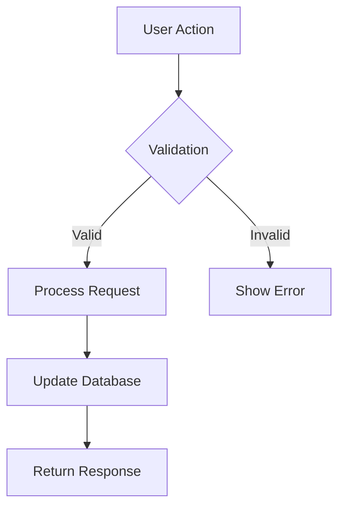
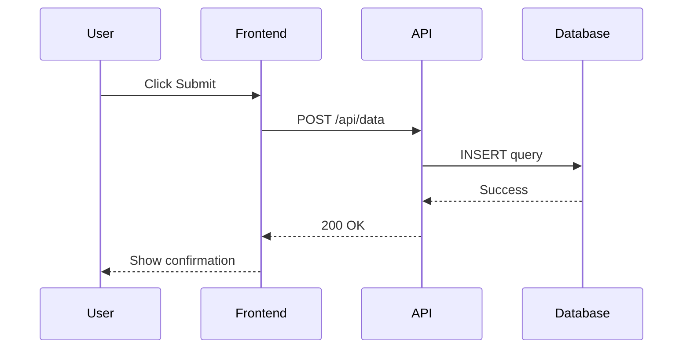
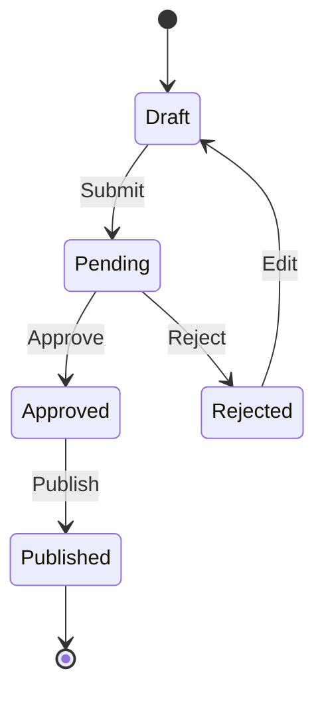
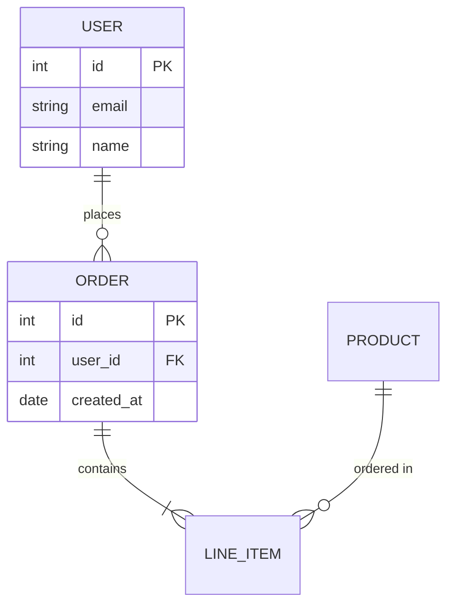

# Issue Writing References

## Related Plugin Workflow

| Command/Agent | Purpose |
|---------------|---------|
| `/planFeature` | Auto-generates parent issues with proper structure |
| `linear-mvp-project-creator` | Creates sub-issues with templates |
| `execute-issue` | Uses acceptance criteria to verify completeness |

## Writing Quality Checklist

```
□ Could a new team member understand this without context?
□ Are acceptance criteria specific and testable?
□ Is the scope clear (what's included AND excluded)?
□ Are dependencies and related issues linked?
□ Are relevant code locations referenced?
```

## The SMART Framework Expanded

### Specific
```
❌ "Login works"
✓ "User can enter email and password on login form"
```

### Measurable
```
❌ "Good user experience"
✓ "Form submits in under 200ms"
```

### Achievable
```
❌ "Build the entire auth system"
✓ "Create login form with email/password fields"
```

### Relevant
```
❌ "Also add dark mode while we're here"
✓ "Login form follows existing form patterns"
```

### Testable
```
❌ "Handle all edge cases"
✓ "Show error message for invalid email format"
```

## Common Issue Templates

### Vertical Slice Issue
```markdown
## Objective
Implement end-to-end [feature] from UI to database.

## Acceptance Criteria
- [ ] UI: [user interaction works]
- [ ] API: [endpoint responds correctly]
- [ ] Data: [persists/retrieves correctly]
- [ ] Error: [failures handled gracefully]
```

### Refactor Issue
```markdown
## Objective
Refactor [component/area] to [improvement].

## Acceptance Criteria
- [ ] [Old pattern] replaced with [new pattern]
- [ ] All existing tests pass
- [ ] No functional changes to behavior
```

### Bug Fix Issue
```markdown
## Bug Description
[What's happening that shouldn't be]

## Expected Behavior
[What should happen instead]

## Acceptance Criteria
- [ ] [Expected behavior works]
- [ ] Regression test added
```

## Mermaid Diagram Quick Reference

Linear renders Mermaid diagrams natively. **Always include diagrams when flows need to be shown or understood.**

### Flowchart (Most Common)
```markdown

```

### Sequence Diagram (API/Service Flows)
```markdown

```

### State Diagram (Status Transitions)
```markdown

```

### Entity Relationship Diagram (Data Models)
```markdown

```

### When to Use Each Type
| Diagram Type | Best For |
|--------------|----------|
| `flowchart TD/LR` | User journeys, decision trees, process flows |
| `sequenceDiagram` | API calls, service-to-service communication |
| `stateDiagram-v2` | Status workflows, lifecycle management |
| `erDiagram` | Database schemas, data relationships |
| `classDiagram` | Component architecture, class hierarchies |
