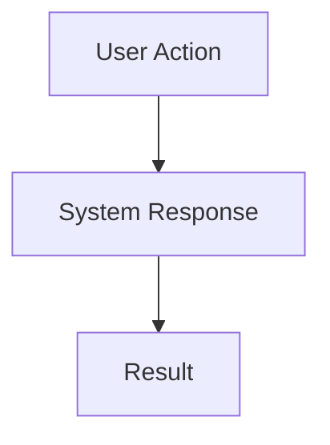

# Linear Plan Mode Integration

When in plan mode, maintain the plan in Linear alongside the plan file. The **orchestrator** handles all Linear operations directly — never delegate to sub-agents for issue creation or updates.

## CRITICAL RULES (ALWAYS FOLLOW)

1. **ALL issues (parent and sub-issues) MUST have status "Todo"** - Never use "Triage", "Backlog", or any other status for new issues
2. **Parent issues MUST have the "Feature Root" label** - NOT "Feature", always "Feature Root"
3. **Never modify "Done" issues** - They represent completed work
4. **Check Linear teams first** - If multiple teams exist, ALWAYS ask the user which team to use before creating issues
5. **Orchestrator does ALL Linear work directly** - Do NOT spawn sub-agents for Linear operations. ToolSearch and MCP tools work in plan mode.

## Key Principle

**All Linear MCP tools work in plan mode.** The orchestrator can call `ToolSearch`, `mcp__linear__create_issue`, `mcp__linear__update_issue`, and `mcp__linear__get_issue` directly. No delegation needed.

## Workflow

### Phase 1: Plan Mode Entry

When entering plan mode for any task:

1. **Ask the user** if this plan should be tracked in Linear
2. **If yes**, load Linear tools directly:
   ```
   ToolSearch: "+linear create issue"
   ```
3. **Check for existing parent issue** using `mcp__linear__get_issue` (if issue ID is known) or `mcp__linear__search_issues`
4. **If no existing issue**, create one directly:
   ```
   mcp__linear__create_issue(
     title: "[feature title]",
     team: "LaserFocused",
     state: "Todo",
     labels: ["Feature Root"],
     description: "[plan overview]"
   )
   ```

### Phase 2: Plan Development (Sync as You Go)

As you write/edit the plan file, keep Linear in sync by calling MCP tools directly:

| Plan File Change | Linear Action |
|------------------|---------------|
| New section added | `mcp__linear__create_issue` with `parentId` |
| Section modified | `mcp__linear__update_issue` with updated description |
| Section removed | `mcp__linear__update_issue` to set state "Canceled" (with user confirmation) |

**Example — creating a sub-issue directly:**
```
mcp__linear__create_issue(
  title: "[Backend] Add student results API endpoint",
  team: "LaserFocused",
  parentId: "<parent-uuid>",
  state: "Todo",
  description: "## Acceptance Criteria\n- [ ] GET endpoint returns student answers\n- [ ] Includes audio URLs\n\n## Depends on\nLAS-XXX (migration)"
)
```

### Phase 3: Plan Finalization

Before calling `ExitPlanMode`:

1. Ensure all plan sections have corresponding Linear sub-issues
2. Parent issue has high-level overview with Mermaid diagram
3. All sub-issues are in "Todo" status ready for execution
4. Sub-issue IDs are recorded in the plan file

## Linear Issue Structure

### Parent Issue (Feature Root)

Parent issues MUST have the "Feature Root" label and follow this structure:

```markdown
## IMPORTANT
This feature is tracked in Linear. Before starting work:
- Find your assigned sub-issue
- Mark it "In Progress" before coding
- Mark it "Done" when complete

## Problem
[What problem we're solving]

## Solution Overview
[High-level approach - 2-3 paragraphs max]

## High-Level Flow


## MVP Scope
**In Scope:**
- [Essential item 1]
- [Essential item 2]

**Out of Scope (Deferred):**
- [Nice-to-have 1]
- [Nice-to-have 2]

## Sub-Issues
[Auto-generated list of child issues]
```

### Sub-Issues (Tagged by Layer)

Each sub-issue title is prefixed with its layer tag:

| Tag | Meaning |
|-----|---------|
| `[Backend]` | Express API, services, repositories |
| `[Frontend]` | React components, pages, hooks |
| `[Migration]` | Database schema changes |
| `[Both]` | Spans backend and frontend |

Sub-issue description format:
```markdown
## Context
[Brief context linking to parent feature]

## Acceptance Criteria
- [ ] Criterion 1
- [ ] Criterion 2

## Technical Notes
[Implementation hints, patterns to follow]

## Dependencies
Depends on: LAS-XXX (if applicable)
```

## Mermaid Diagrams

Use diagrams to visualize flows and relationships:

| Context | Diagram Type | When to Use |
|---------|--------------|-------------|
| Parent issue | `flowchart TD` | Main user/data flow (REQUIRED) |
| API endpoints | `sequenceDiagram` | Service interactions |
| State machines | `stateDiagram-v2` | Status workflows |
| Data models | `erDiagram` | Entity relationships |

For detailed templates, see [mermaid-templates.md](mermaid-templates.md).

## Key Constraints

- **Orchestrator does ALL Linear work** — never delegate to sub-agents or linear-manager for issue creation
- **Never modify "Done" issues** — They represent completed work
- **Confirm before canceling** — Ask user before canceling "In Progress" issues
- **Todo status only** — ALL new issues MUST start as "Todo"
- **"Feature Root" label (not "Feature")** — Parent issues ALWAYS get the "Feature Root" label
- **linear-manager is for implementation only** — It tracks status during Phase 5, not during planning

## Quick Reference

**Load Linear tools:**
```
ToolSearch: "+linear create issue"
```

**Create parent issue:**
```
mcp__linear__create_issue(
  title: "Feature title",
  team: "LaserFocused",
  state: "Todo",
  labels: ["Feature Root"],
  description: "[plan overview with mermaid diagram]"
)
```

**Create sub-issue:**
```
mcp__linear__create_issue(
  title: "[Backend] Step description",
  team: "LaserFocused",
  parentId: "<parent-uuid>",
  state: "Todo",
  description: "[acceptance criteria + dependencies]"
)
```

**Update issue:**
```
mcp__linear__update_issue(
  issueId: "<uuid>",
  description: "[updated content]"
)
```

For detailed sync patterns, see [sync-patterns.md](sync-patterns.md).
