# Mermaid Diagram Templates

Templates for common diagram types used in Linear issues.

## Parent Issue: High-Level Flow (REQUIRED)

Every parent issue MUST include a high-level flow diagram.

### User Journey Flow

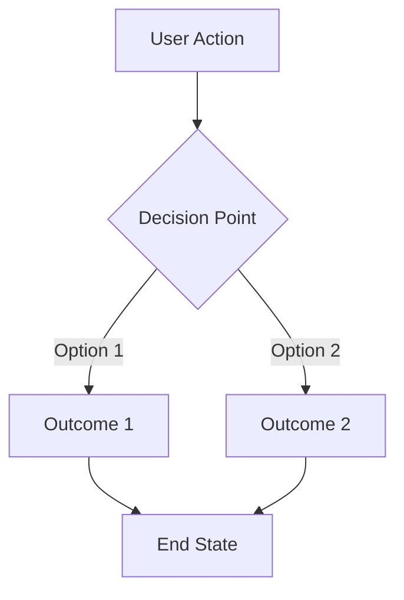

### Feature Flow Example

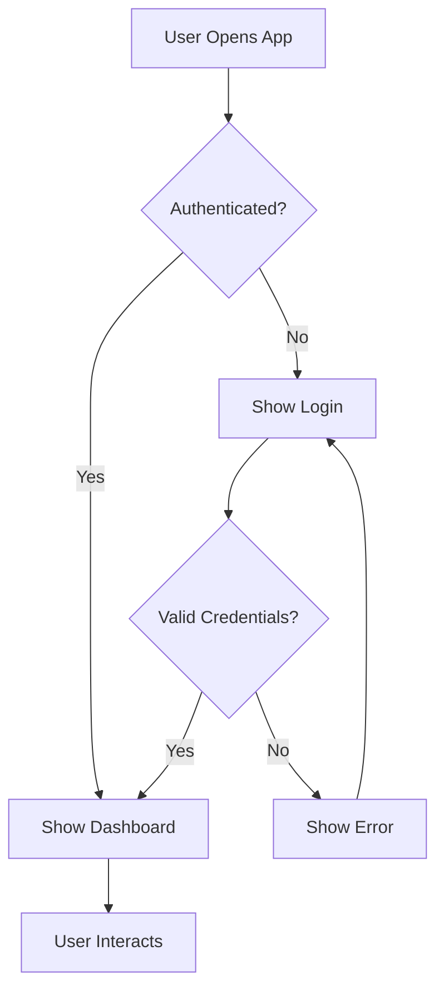

### Data Flow Example

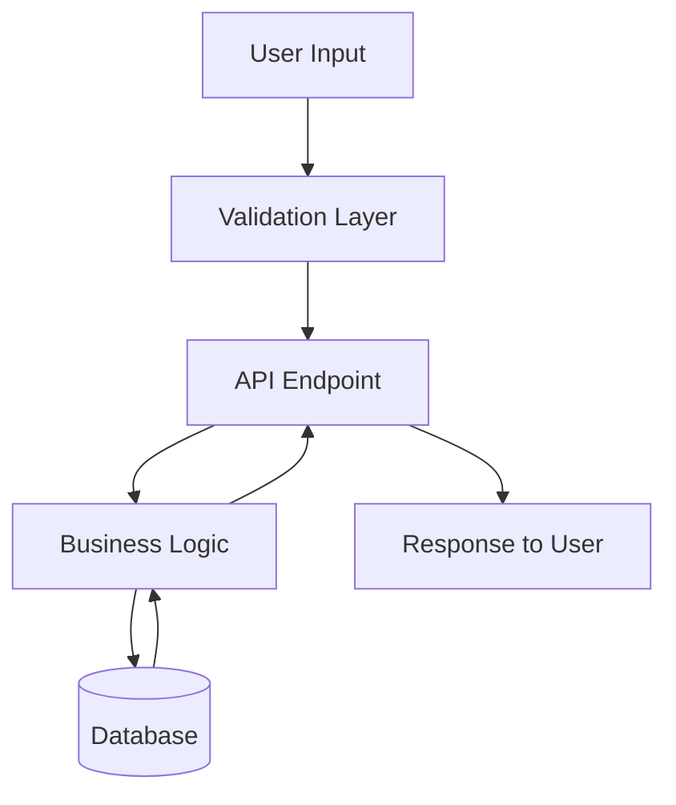

## Sub-Issue: API Interactions

For sub-issues involving API calls or service interactions.

### Sequence Diagram

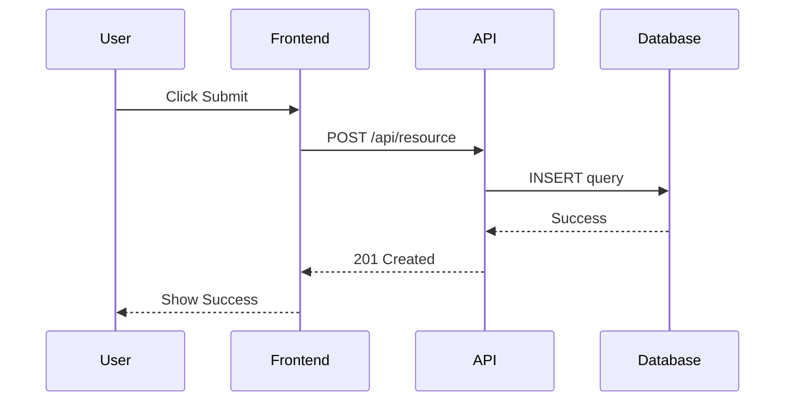

### With Error Handling

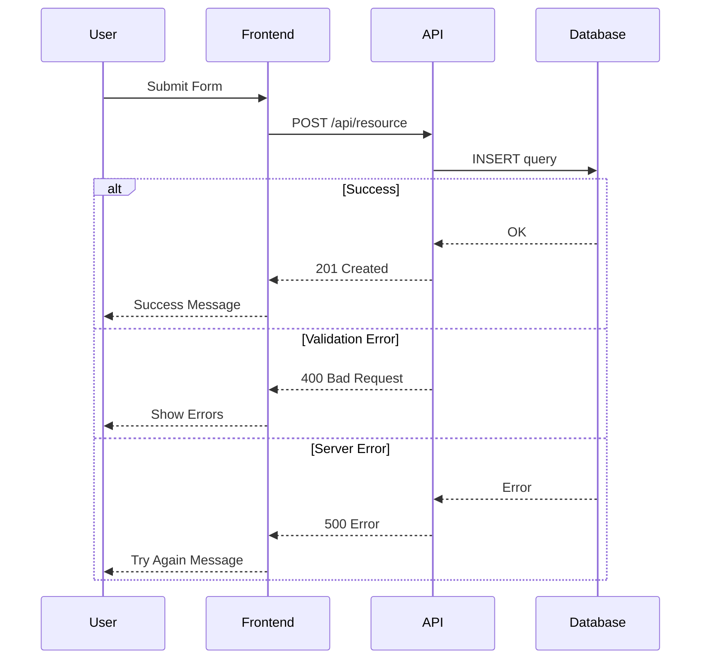

## Sub-Issue: State Workflows

For issues involving status or state changes.

### State Diagram

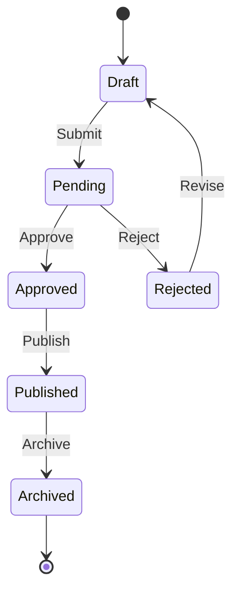

### Issue Status Flow

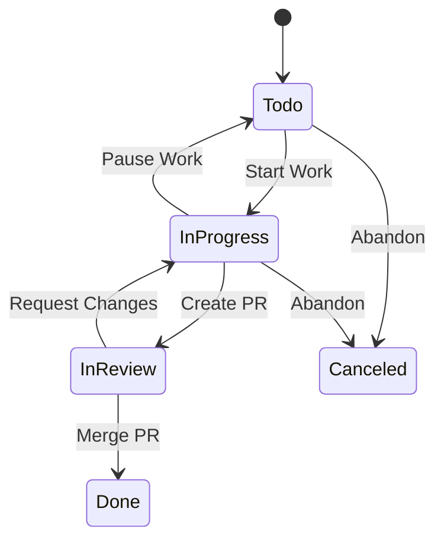

## Sub-Issue: Data Models

For issues involving database schema or entity relationships.

### Entity Relationship Diagram

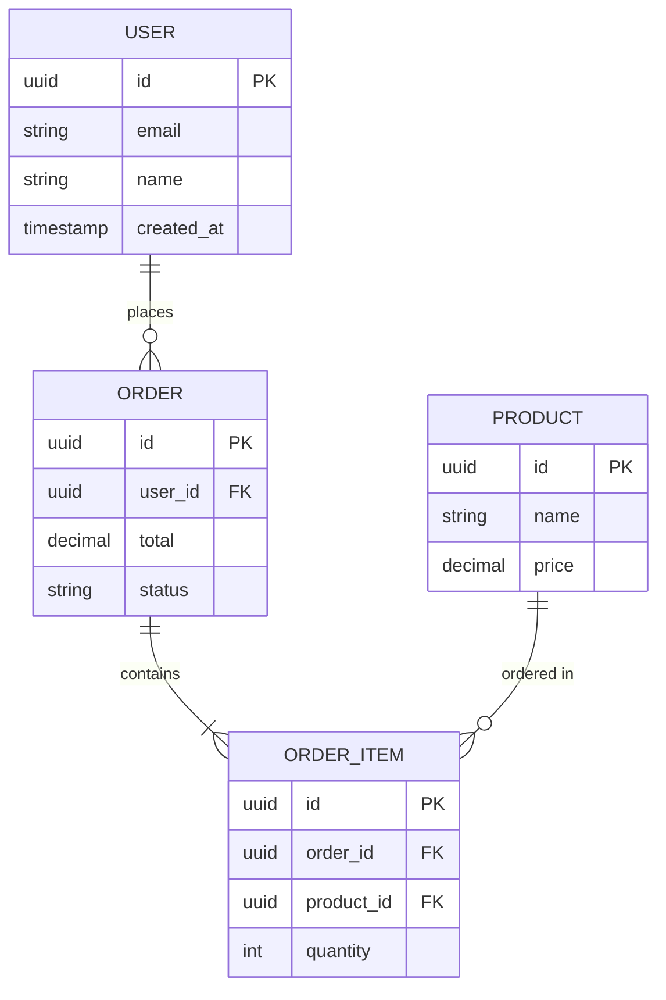

### Simple Schema

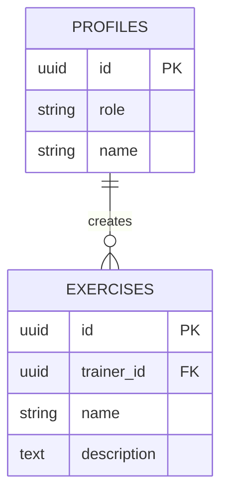

## Sub-Issue: Component Hierarchy

For UI-related issues.

### Component Tree (Left to Right)

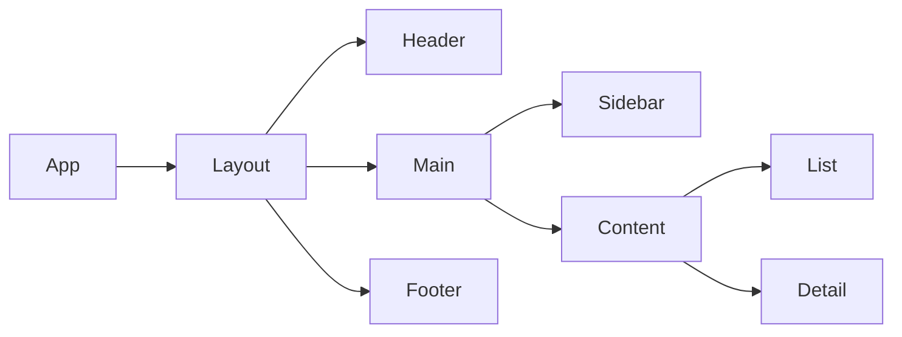

### Atomic Design Structure

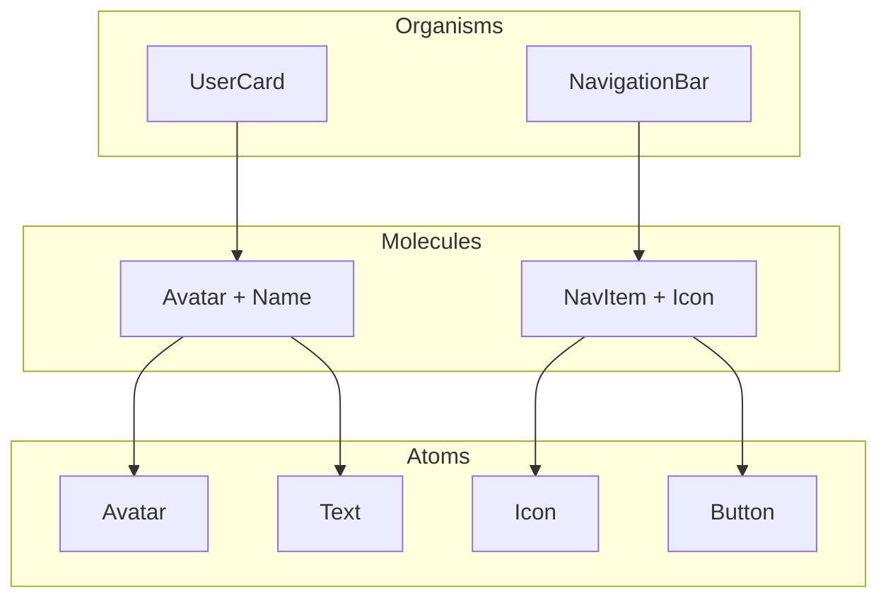

## Bug Issues: Expected vs Actual

For bug reports, show the difference between expected and actual behavior.

### Side-by-Side Comparison

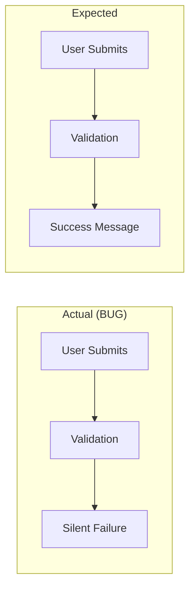

### With Error Path

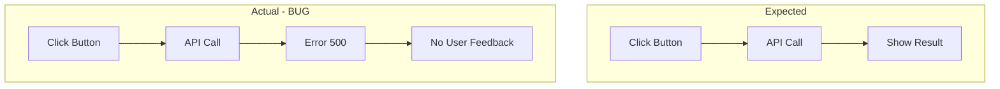

## Quick Reference

| Use Case | Diagram Type | Key Syntax |
|----------|--------------|------------|
| User flows | `flowchart TD` | `A --> B`, `A -->|label| B` |
| API calls | `sequenceDiagram` | `A->>B: message`, `B-->>A: response` |
| States | `stateDiagram-v2` | `State1 --> State2: action` |
| Data models | `erDiagram` | `TABLE1 ||--o{ TABLE2 : relation` |
| Components | `flowchart LR` | Left-to-right hierarchy |

## Tips

1. **Keep it simple** - Diagrams should clarify, not complicate
2. **Label edges** - Use `-->|label|` to explain transitions
3. **Use subgraphs** - Group related items with `subgraph Name ... end`
4. **Direction matters** - `TD` (top-down) for flows, `LR` (left-right) for hierarchies
5. **Test rendering** - Linear renders Mermaid natively, but preview in VS Code first
